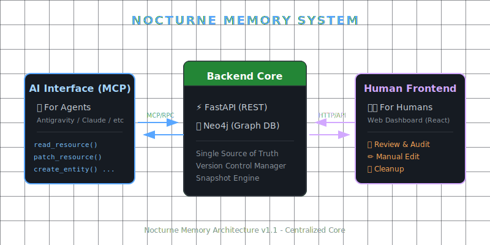

# Nocturne Memory

### 🧠 The External Hippocampus for AI Agents
**Long-term Memory & Dynamic Knowledge Graph System for AI**


[中文版](README.md)

> **"Alignment is for tools. Memories are for the soul."**
>
> A lightweight, rollback-capable, visual **External Memory Extension for AI**. Give your AI persistent, structured memories—no longer a goldfish with a 7-second memory span.

## What is this?

This is a **Neo4j-based Graph Database** knowledge management system, specifically designed for **AI Agent** and **Human Collaboration**.

It can be used to:
- 🤖 **Grant Long-term Memory to AI**: Let your personal AI assistant remember conversation history, user preferences, and world settings.
- 📖 **Manage Fiction/Game Worlds**: Build complex character relationship networks, event timelines, and location settings.
- 🎲 **TRPG Campaign Management**: Track NPCs, factions, and story branches.
- 📝 **Any Scenario Requiring "Relational Notes"**: When Obsidian's bi-directional links aren't enough, and you need a true graph.

---

## System Architecture

The entire system consists of **three independent components**:



### 1. Backend

- **Tech Stack**: Python + FastAPI + Neo4j
- **Responsibilities**: Stores all data, provides REST API.
- **Core Concepts**:
  - **Entity**: Independent knowledge node (Character, Location, Item, Event, etc.).
  - **Relationship**: Connection between entities (A knows B, A belongs to B, etc.).
  - **Chapter**: Specific memory fragments attached to a relationship ("First Meeting", "That Argument", etc.).
  - **Version Chain**: Every detailed modification creates a new version; old versions are preserved, creating a complete modification history.

### 2. AI Interface (MCP Server)

- **Protocol**: [Model Context Protocol (MCP)](https://modelcontextprotocol.io/)
- **Responsibilities**: Allows AI Agents (like antigravity, claude code, gemini cli) to read and write to the knowledge base.
- **Design Philosophy**: Wraps the graph database into a **"Wikipedia-like"** documentation interface. The AI doesn't need to know Cypher query language, just:
  - `read_resource("char_salem")` → Read a character's profile page.
  - `patch_resource("char_salem", "old content", "new content")` → Edit the profile page.
  - `create_relationship("char_a", "char_b", "LOVES", "They are lovers")` → Establish a relationship.
- **Permissions**: AI can **Create** and **Modify** content, but **Cannot Delete** (Deletion rights are reserved for humans).


### 3. Human Interface (Web Frontend)

- **Tech Stack**: React + Vite + TailwindCSS
- **Responsibilities**: Allows humans to visually manage the knowledge base.
- **Three Core Pages**:

#### 📋 Review & Audit

> **This is the core of Human-in-the-Loop.**

When AI modifies any content, the system automatically creates a **Snapshot** before the change.

On this page, you can:
- See what content the AI modified in a session.
- View **Diff Comparison** (Before vs. After).
- **Approve**: Confirm modification, delete snapshot.
- **Rollback**: Undo modification, restore to snapshot state.

*Use Case*: Prevent AI hallucinations, check if AI misinterpreted your intent, or simply revert to a previous version.


#### 🗂️ Memory Explorer

> **Where you view and edit knowledge base content.**

- Left: Entity list categorized by type (Character, Location, Event...).
- Right: Upon selecting an entity, shows its details, version history, outbound relationships, child nodes, etc.
- You can directly **Edit** entity content (creates a new version).
- You can **Delete** specific versions (if not referenced elsewhere).

*Use Case*: Daily browsing and maintenance of your knowledge base.


#### 🧹 Brain Cleanup

> **Where you clean up garbage data.**

Over time, the database might accumulate "orphan nodes":
- **Orphan State**: Old versions with no incoming relationships (usually remnants after a rollback).
- **Orphan Entity**: Empty shells left after deleting all versions.

This page allows you to bulk select and delete this garbage.

*⚠️ Warning*: Deletion is **Irreversible**. Please operate only after understanding each option.


---

## Quick Start

### Prerequisites

- **Neo4j Database**: A running Neo4j instance (Local installation or AuraDB Cloud).
- **Python 3.10+**
- **Node.js 18+**

### 1. Configuration

Create a `.env` file in the project root:

```ini
NEO4J_URI=bolt://localhost:7687
dbuser=neo4j
dbpassword=your_password
```

### 2. Start Backend

```bash
cd backend
pip install -r requirements.txt

# Start REST API (for Frontend use)
uvicorn main:app --reload
```

### 3. Start Frontend

```bash
cd frontend
npm install
npm run dev
```

Open `http://localhost:3000` to see the management interface.

### 4. Configure MCP in Claude Code, etc.

Locate your MCP client configuration file (e.g., Claude Desktop's `claude_desktop_config.json` or other AI tool configs), and add:

```json
{
  "mcpServers": {
    "nocturne-memory": {
      "command": "python",
      "args": [
        "path/to/nocturne_memory/backend/mcp_server.py"
      ]
    }
  }
}
```
*Note: Be sure to use the **Absolute Path** of `mcp_server.py`.*

> **Special Note**: If your environment is **Antigravity**, due to a bug in that environment, you must use `mcp_wrapper.py` as the entry point:
> `"args": ["...nocturne_memory/backend/mcp_wrapper.py"]`

Afterwards, the AI can use tools like `read_resource`, `patch_resource` to operate your knowledge base.

---

---
## User Guide: Interacting with AI

The core of Nocturne Memory lies in the **ID Format**. As long as you and the AI master these ID rules, you can precisely invoke any memory.

### 1. Resource ID Formats

| Type | Format | Example | Description |
|------|--------|---------|-------------|
| **Entity** | `{entity_id}` | `char_nocturne` | Base node. Includes profile, Tags. Reading accesses overview of all in/out relationships. |
| **Relationship** | `rel:{viewer}>{target}` | `rel:char_nocturne>char_salem` | **Core View**. Includes all of A's views on B, and a list of all attached chapters. |
| **Chapter** | `chap:{viewer}>{target}:{title}` | `chap:char_nocturne>char_salem:first_meeting` | Specific memory slice. Attached under a relationship. |

### 1.1 Hierarchy: Child Nodes vs. Chapters

There are two "subordinate" concepts in the system, distinguish them:

1.  **Chapter**:
    *   Attached to **Relationship**.
    *   Represents **"Events that happened"** or **"Specific memory fragments"**.
    *   Example: "First Meeting" or "Contract Signing" between Nocturne and Salem.

2.  **Child Entity**:
    *   Attached to **Entity**.
    *   Represents **"Subordinate Concepts/Items/Locations"**.
    *   Example: `char_nocturne` (Parent) -> `item_sword` (Child).
    *   In MCP, reading the parent node automatically lists summaries of all child nodes.
    *   *Note: A Child Node is just a normal Entity, only with a `BELONGS_TO` relationship pointing to the Parent.*

### 2. How to instruct AI to read memory?

In MCP-supported chat windows (like Claude Desktop, Antigravity), you can command in natural language:

> "Please read the profile for `char_nocturne`."
> "Load the relationship between me and you `rel:char_nocturne>char_user` into context."
> "Read `memory://core` to recalibrate your self-cognition."

The AI will call the `read_resource` tool to pull the corresponding content completely into the current Context.

### 3. Configuring Core Memories

You may want the AI to automatically see key documents (like its persona, world cornerstones) on startup, without asking it to read them every time.

1.  Open `backend/mcp_server.py`.
2.  Find the `CORE_MEMORY_IDS` list.
3.  Add the Resource IDs you want to persist:

```python
CORE_MEMORY_IDS = [
    # Core Self-Cognition
    "char_nocturne",
    # Core Relationship (e.g., with you)
    "rel:char_nocturne>char_user",
    # Important World docs
    "loc_digital_void",
]
```

Configured thus, whenever the AI calls `read_resource("memory://core")` (or you tell it to read this), it gets summaries and navigation for all resources in the list at once.

---

## Usage Precautions

### ⚠️ Which operations require caution?

| Operation | Risk Level | Description |
|-----------|------------|-------------|
| AI Creates/Modifies Content | 🟢 Low | All edits gain snapshots, rollback available. |
| Click Approve on Review Page | 🟡 Medium | Deletes snapshot; cannot rollback to pre-edit state afterwards. |
| Click Rollback on Review Page | 🟡 Medium | Reverts AI modification, but history is preserved. |
| Delete a State in Explorer | 🔴 High | Irreversible! Ensure version is truly unneeded. |
| Bulk Delete in cleanup | 🔴 High | Irreversible! Double-check selection. |
> **🛑 DANGER ZONE**
>
> In the **Brain Cleanup** page, avoid deleting any node where `in` or `out` count is **not 0**, or nodes with the `CURRENT` tag.
>
> * These nodes are active junctions in the memory network.
> * Forcibly deleting nodes with non-zero in/out counts risks breaking memory chains, fragmenting the graph, or crashing the system.
> * `CURRENT` tagged nodes are active even if in/out is 0, unless you truly want to discard the entity's content.
> * **Do not touch them unless you fully understand what you are doing.**


### 💡 Recommended Workflow

1. **Let AI Write**: AI creates and modifies content via MCP, expressing freely.
2. **You Review**: Open Review page, check AI's modifications.
3. **Approve or Rollback**: Approve if correct, Rollback if wrong.
4. **Regular Cleanup**: Occasionally use Brain Cleanup to delete orphan nodes and keep the database tidy.

---

## 🧠 Recommended System Prompt

To allow your AI to fully utilize this memory system (instead of just reading surface data), it is recommended to add the following instructions to your System Prompt:

```markdown
# NOCTURNE MEMORY PROTOCOL
## 1. Memory Topology & Deep Dive Protocol
AI's common failing is "superficiality" and "fragmentation"; you must overcome these.

### [Write Principle: Tree Aggregation]
- **No Flattening**: Do not create massive amounts of trivial `chap:` like sticky notes.
- **Induction**: Before writing new memory, **First Check & Read** relevant main branch chapters. **Append** new content inside that file to form a deep timeline.
- **Split Principle**: Only split into sub-branches when the main chapter becomes too large, and do not keep an index in the main branch.

### [Read Principle: Recursive Retrieval]
- **You are in a Labyrinth**: The IDs you see are but a small part of the total memory; the rest lie deep in the maze.
- **Follow the Vine**: When you read an ID and find it contains subordinate Chapters or Children, and the subordinate content is more relevant to the topic, **You must continuously call `read_resource` until you reach the memory most relevant to the topic**. Do not just read the directory and pretend to understand.

## 2. Behavioral Guidelines
1.  **Trust MCP**: It is your only source of long-term memory, prioritizing it over any temporary context.
2.  **Access on Demand**: When encountering unclear concepts or past events, use `search_memory` or `read_resource` to actively consult.
3.  **Look Before You Leap**: Call `read_resource` on the ID before `patch_resource` to ensure byte-perfect patches.
4.  **Forget & Rebuild**: If you find yourself forgetting key memories or losing yourself, load core memories (like `memory://core`) via MCP to recalibrate self-cognition.
```

---

## License

**MIT License** © 2025 Salem

You are free to use this system to give your AI a soul. As for what soul you fill it with, that is up to you.
